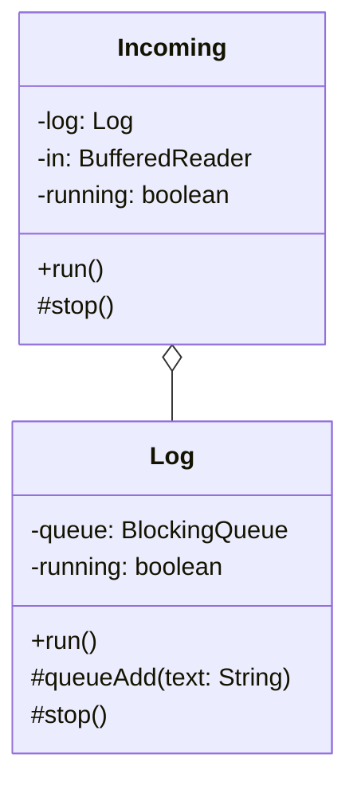

# клиент чат на java

---
### клиент состоит из 3 потоков
1. основной поток (main)

    в нём создаём сокет и реализуем ввод и отправку сообщений на сервер.
2. поток в классе (Incoming)
    

    в нём читаем входящие сообщения и выводим на экран и одновременно закидываем 
    все входящие сообщения в очередь на запись в файл.
3. поток в классе (Log)

    отвечает за запись всех входящих сообщений в file.log

### протокол обмена сообщениями: 
    обязательно ввести имя при подключении не более 20 символов,
    длина сообщения не более 100 символов.

### блок схема

